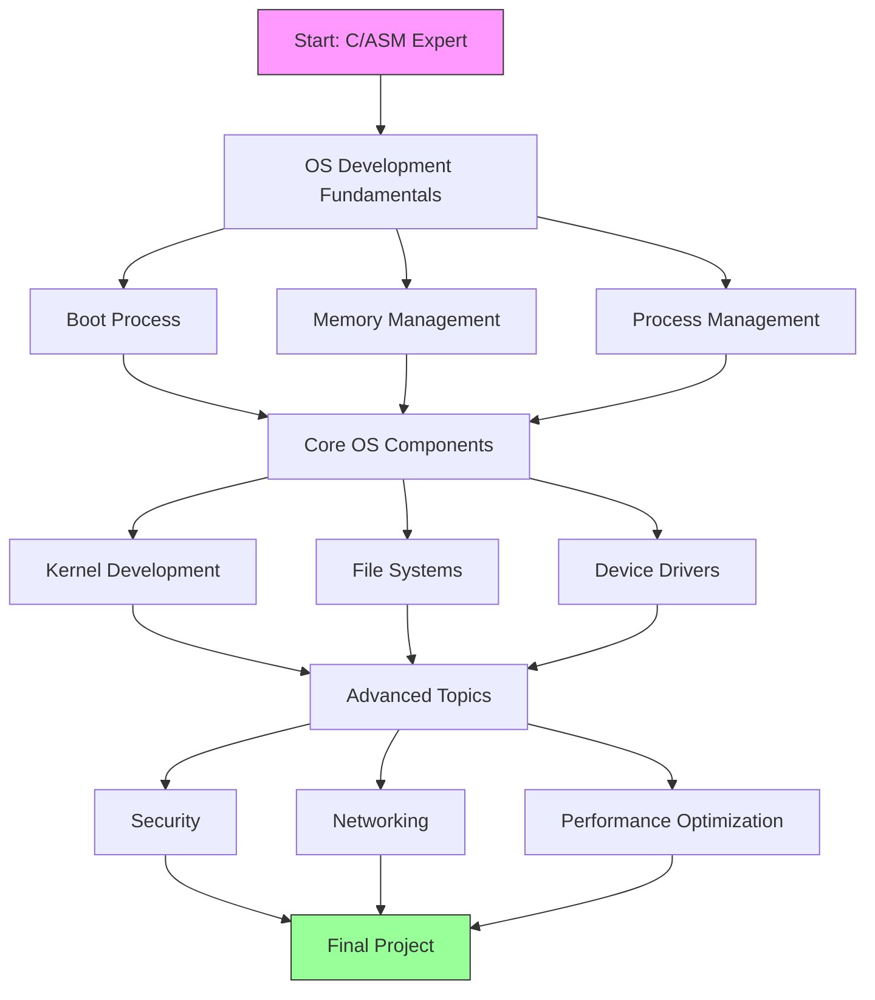

# Operating System Development Roadmap (Advanced Path)

## How to Follow?

## Prerequisites (Quick Review)
- Advanced C programming concepts
- x86/x64 Assembly fundamentals
- Computer Architecture basics

## Phase 1: OS Development Fundamentals
### 1.1 Boot Process Deep Dive
- BIOS and UEFI internals
- Bootloader development
- Real mode to Protected mode transition
- Resource: [OSDev Wiki - Boot Sequence](https://wiki.osdev.org/Boot_Sequence)
- Practice: Write a custom bootloader

### 1.2 Memory Management
- Paging and Virtual Memory implementation
- Memory allocation algorithms
- Memory mapping and protection
- Resource: [Understanding Virtual Memory](https://wiki.osdev.org/Memory_Management)
- Practice: Implement a basic memory manager

### 1.3 Process Management
- Process scheduling algorithms
- Context switching implementation
- Thread management
- Resource: [Process Management Guide](https://wiki.osdev.org/Process_Management)

## Phase 2: Core OS Components
### 2.1 Kernel Development
- Kernel architecture design
- Interrupt handling
- System calls implementation
- Resource: [Writing a Simple Kernel](https://wiki.osdev.org/Kernels)

### 2.2 File Systems
- File system design and implementation
- VFS (Virtual File System) development
- Disk I/O and caching
- Resource: [File Systems](https://wiki.osdev.org/File_Systems)

### 2.3 Device Drivers
- Device driver architecture
- PCI device handling
- USB subsystem implementation
- Resource: [Writing Device Drivers](https://wiki.osdev.org/Category:Device_Drivers)

## Phase 3: Advanced Topics
### 3.1 Security
- Memory protection
- Process isolation
- Security policies
- Resource: [OS Security](https://wiki.osdev.org/Security)

### 3.2 Networking
- Network stack implementation
- Protocol support
- Socket programming
- Resource: [Network Stack](https://wiki.osdev.org/Network_Stack)

### 3.3 Performance Optimization
- CPU scheduling optimization
- Memory access patterns
- Caching strategies
- Resource: [OS Optimization](https://wiki.osdev.org/Optimization)

## Recommended Tools
- QEMU/Bochs for emulation
- GDB for debugging
- NASM/YASM for assembly
- Cross-compiler toolchain

## Practical Projects
1. Implement a basic Unix-like kernel
2. Create a custom file system
3. Develop a network stack
4. Build a driver framework

## Additional Resources
- [Operating Systems: Three Easy Pieces](http://pages.cs.wisc.edu/~remzi/OSTEP/)
- [xv6 Operating System](https://pdos.csail.mit.edu/6.828/2019/xv6.html)
- [Linux Kernel Development by Robert Love](https://www.amazon.com/Linux-Kernel-Development-Robert-Love/dp/0672329468)
