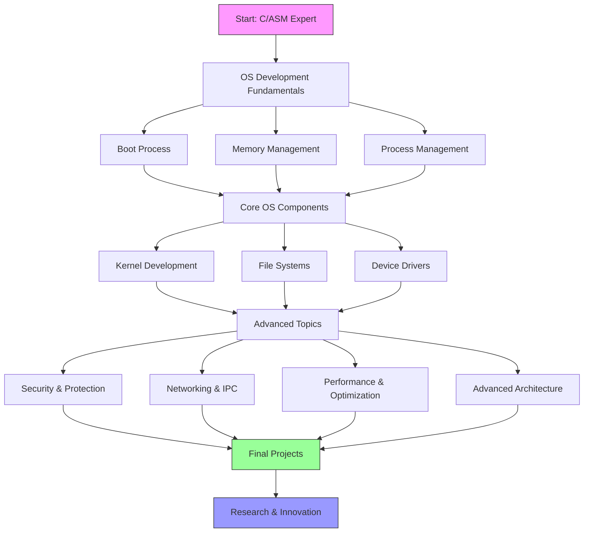

# Advanced Operating System Development Roadmap

## How to Follow?

## Prerequisites Review & Deep Dive
### Advanced C Programming
- Advanced Memory Management: [Advanced C Memory Guide](https://www.kernel.org/doc/html/latest/core-api/memory-allocation.html)
- Inline Assembly in C: [GCC Inline Assembly Guide](https://gcc.gnu.org/onlinedocs/gcc/Using-Assembly-Language-with-C.html)
- Volatile & Atomic Operations: [C Atomics Guide](https://en.cppreference.com/w/c/atomic)
- Bit Manipulation Techniques: [Bit Twiddling Hacks](https://graphics.stanford.edu/~seander/bithacks.html)

### x86/x64 Assembly Mastery
- CPU Modes & Privileges: [Intel Software Developer Manual](https://www.intel.com/content/www/us/en/developer/articles/technical/intel-sdm.html)
- SIMD Instructions: [x86 SIMD Programming](https://www.intel.com/content/www/us/en/develop/documentation/cpp-compiler-developer-guide-and-reference/top/compiler-reference/intrinsics/intrinsics-for-intel-advanced-vector-extensions-2.html)
- Modern x86 Features: [AMD64 Architecture Guide](https://developer.amd.com/resources/developer-guides-manuals/)
- Assembly Optimization: [Agner's Assembly Optimization](https://www.agner.org/optimize/)

### Computer Architecture Foundations
- Cache Architecture: [CPU Cache Tutorial](https://www.extremetech.com/computing/210879-how-l1-and-l2-cpu-caches-work)
- Pipelining & Superscalar: [Modern Processor Design](https://safari.ethz.ch/digitaltechnik/spring2019/lib/exe/fetch.php?media=dayclass16.pdf)
- Memory Hierarchy: [Memory Systems Cache, DRAM, Disk](https://safari.ethz.ch/digitaltechnik/spring2019/lib/exe/fetch.php?media=morgan_kaufmann_memory_systems_cache_dram_disk.pdf)

## Phase 1: OS Development Fundamentals
### 1.1 Boot Process Deep Dive
- UEFI Programming: [UEFI Programming Guide](https://uefi.org/specifications)
- Secure Boot Implementation: [OSDev Secure Boot](https://wiki.osdev.org/Unified_Extensible_Firmware_Interface#Secure_Boot)
- Multiboot Specification: [GNU Multiboot](https://www.gnu.org/software/grub/manual/multiboot/multiboot.html)
- ACPI Implementation: [ACPI Specification](https://uefi.org/specifications)
- Early Hardware Init: [OSDev Hardware Initialization](https://wiki.osdev.org/Hardware_Initialization)

### 1.2 Advanced Memory Management
- Paging Structures: [Intel Paging Guide](https://www.intel.com/content/www/us/en/developer/articles/technical/intel-sdm.html#combined)
- Virtual Memory Implementation: [Understanding Virtual Memory](https://www.kernel.org/doc/html/latest/admin-guide/mm/concepts.html)
- Memory Allocators: [Memory Allocator Designs](https://github.com/emeryberger/CSrankings/blob/master/allocators.md)
- NUMA Architecture: [Linux NUMA Guide](https://www.kernel.org/doc/html/latest/admin-guide/mm/numa_memory_policy.html)
- TLB Management: [TLB Management Guide](https://www.kernel.org/doc/html/latest/core-api/mm-api.html#translation-lookaside-buffer-tlb-handling)

### 1.3 Process Management
- Advanced Scheduling: [Linux Scheduler Implementation](https://www.kernel.org/doc/html/latest/scheduler/sched-design-CFS.html)
- Real-time Scheduling: [RT-Linux Guide](https://wiki.linuxfoundation.org/realtime/documentation/start)
- Context Switching: [Low-Level Context Switch](https://wiki.osdev.org/Context_Switching)
- Thread Implementation: [Threading Building Blocks](https://spec.oneapi.io/versions/latest/elements/oneTBB/source/index.html)
- Process Synchronization: [Advanced Synchronization Primitives](https://www.kernel.org/doc/html/latest/locking/index.html)

## Phase 2: Core OS Components
### 2.1 Kernel Development
- Microkernel Design: [L4 Microkernel Guide](https://l4re.org/docs/)
- Monolithic Implementation: [Linux Kernel Guide](https://www.kernel.org/doc/html/latest/kernel-hacking/index.html)
- Hybrid Approaches: [XNU Kernel Architecture](https://github.com/apple/darwin-xnu)
- System Calls: [Syscall Implementation](https://www.kernel.org/doc/html/latest/core-api/syscalls.html)
- Interrupt Handling: [Advanced IRQ Management](https://www.kernel.org/doc/html/latest/core-api/genericirq.html)

### 2.2 File Systems
- VFS Layer: [Linux VFS Guide](https://www.kernel.org/doc/html/latest/filesystems/vfs.html)
- Journaling: [Ext4 Journaling](https://www.kernel.org/doc/html/latest/filesystems/ext4/index.html)
- Cache Management: [Page Cache](https://www.kernel.org/doc/html/latest/admin-guide/mm/concepts.html#page-cache)
- Modern FS Features: [BTRFS Design](https://btrfs.wiki.kernel.org/index.php/Design_notes)
- Network FS: [NFS Implementation](https://www.kernel.org/doc/html/latest/filesystems/nfs/index.html)

### 2.3 Device Drivers
- Driver Framework: [Linux Driver Model](https://www.kernel.org/doc/html/latest/driver-api/driver-model/index.html)
- USB Stack: [USB Driver Guide](https://www.kernel.org/doc/html/latest/driver-api/usb/index.html)
- GPU Drivers: [DRM/KMS Guide](https://www.kernel.org/doc/html/latest/gpu/index.html)
- Network Drivers: [Network Driver Programming](https://www.kernel.org/doc/html/latest/networking/index.html)
- Block Devices: [Block Layer Guide](https://www.kernel.org/doc/html/latest/block/index.html)

## Phase 3: Advanced Topics
### 3.1 Security & Protection
- Secure Boot Chain: [Chain of Trust Implementation](https://uefi.org/sites/default/files/resources/UEFI_Secure_Boot_in_Modern_Computer_Security_Solutions_2013.pdf)
- Memory Protection: [KASLR Implementation](https://www.kernel.org/doc/html/latest/admin-guide/kernel-parameters.html#cpu-security-features)
- Access Control: [SELinux Architecture](https://github.com/SELinuxProject/selinux)
- Trusted Execution: [Intel SGX Programming](https://software.intel.com/content/www/us/en/develop/topics/software-guard-extensions.html)
- Virtualization Security: [KVM Security Features](https://www.linux-kvm.org/page/Security)

### 3.2 Networking & IPC
- TCP/IP Stack: [Network Stack Implementation](https://www.kernel.org/doc/html/latest/networking/index.html)
- Zero-copy Networking: [DPDK Architecture](https://doc.dpdk.org/guides/prog_guide/)
- IPC Mechanisms: [System V IPC](https://www.kernel.org/doc/html/latest/admin-guide/sysvipc.html)
- Socket Programming: [Network Programming Guide](https://beej.us/guide/bgnet/)
- Protocol Implementation: [Networking Concepts](https://www.kernel.org/doc/html/latest/networking/concepts.html)

### 3.3 Performance & Optimization
- CPU Scheduler Tuning: [CFS Scheduler Tuning](https://www.kernel.org/doc/html/latest/scheduler/sched-design-CFS.html)
- Memory Subsystem: [Memory Optimization](https://www.kernel.org/doc/html/latest/admin-guide/mm/index.html)
- I/O Scheduling: [Block I/O Optimization](https://www.kernel.org/doc/html/latest/block/index.html)
- Profile-guided Optimization: [Kernel Profiling Guide](https://www.kernel.org/doc/html/latest/trace/index.html)
- System Tuning: [Performance Tuning Guide](https://access.redhat.com/documentation/en-us/red_hat_enterprise_linux/8/html/monitoring_and_managing_system_status_and_performance/index)

## Research Papers
1. ["Exokernel: An Operating System Architecture for Application-Level Resource Management"](https://pdos.csail.mit.edu/6.828/2008/readings/engler95exokernel.pdf)
2. ["The Performance of µ-Kernel-Based Systems"](https://os.inf.tu-dresden.de/papers_ps/sosp97.pdf)
3. ["Unikernels: Library Operating Systems for the Cloud"](https://anil.recoil.org/papers/2013-asplos-mirage.pdf)
4. ["The Linux Scheduler: A Decade of Wasted Cores"](https://www.ece.ubc.ca/~sasha/papers/eurosys16-final29.pdf)
5. ["Understanding and Designing New Server Architectures for Emerging Warehouse-Computing Environments"](https://people.inf.ethz.ch/troscoe/pubs/hotos07-serverarch.pdf)
6. ["The Multikernel: A New OS Architecture for Scalable Multicore Systems"](https://www.sigops.org/s/conferences/sosp/2009/papers/baumann-sosp09.pdf)
7. ["Efficient Memory Management in OS Kernels"](https://www.kernel.org/doc/Documentation/vm/page_alloc.txt)
8. ["The Design and Implementation of a Log-Structured File System"](https://people.eecs.berkeley.edu/~brewer/cs262/LFS.pdf)
9. ["KLEE: Unassisted and Automatic Generation of High-Coverage Tests for Complex Systems Programs"](https://llvm.org/pubs/2008-12-OSDI-KLEE.pdf)
10. ["seL4: Formal Verification of an OS Kernel"](https://sel4.systems/publications/nicta_full.pdf)

## Books
1. "Modern Operating Systems" by Andrew S. Tanenbaum
2. "Operating System Concepts" by Silberschatz, Galvin, and Gagne
3. "Linux Kernel Development" by Robert Love
4. "Understanding the Linux Kernel" by Daniel P. Bovet
5. "Operating Systems: Three Easy Pieces" by Remzi H. Arpaci-Dusseau
6. "The Design and Implementation of the FreeBSD Operating System" by McKusick
7. "Linux Device Drivers" by Jonathan Corbet
8. "OS: Design and Implementation" by Andrew S. Tanenbaum
9. "Advanced Programming in the UNIX Environment" by W. Richard Stevens
10. "System Programming with C and Unix" by Adam Hoover

## Online Courses
1. [MIT 6.828: Operating System Engineering](https://pdos.csail.mit.edu/6.828/2020/schedule.html)
2. [Stanford CS140: Operating Systems](https://web.stanford.edu/~ouster/cgi-bin/cs140-spring20/index.php)
3. [Berkeley CS162: Operating Systems](https://cs162.org/)
4. [Harvard CS161: Operating Systems](https://www.eecs.harvard.edu/~cs161/)
5. [Georgia Tech CS6200: Graduate Introduction to Operating Systems](https://omscs.gatech.edu/cs-6200-introduction-operating-systems)
6. [Coursera: Operating Systems and You](https://www.coursera.org/learn/os-power-user)
7. [edX: LinuxFoundationX: Introduction to Linux](https://www.edx.org/course/introduction-to-linux)
8. [Udacity: Advanced Operating Systems](https://www.udacity.com/course/advanced-operating-systems--ud189)

## Development Tools
- Cross Compiler: [Cross Linux From Scratch](https://clfs.org/)
- Debugging Tools: [GDB Guide](https://sourceware.org/gdb/current/onlinedocs/gdb/)
- Emulators: [QEMU Documentation](https://www.qemu.org/docs/master/)
- Performance Tools: [Linux Perf Tools](https://perf.wiki.kernel.org/index.php/Main_Page)
- Static Analysis: [Coverity Scan](https://scan.coverity.com/)
- Dynamic Analysis: [Valgrind Tools](https://valgrind.org/docs/)

## Final Projects
1. Implement a microkernel OS
2. Build a real-time operating system
3. Create a specialized IoT operating system
4. Develop a secure hypervisor
5. Design a distributed operating system

## Additional Resources
- [OSDev Wiki](https://wiki.osdev.org/Main_Page)
- [The Linux Documentation Project](https://tldp.org/)
- [Linux Kernel Newbies](https://kernelnewbies.org/)
- [Linux Weekly News](https://lwn.net/)
- [ACM SIGOPS](https://www.sigops.org/)
- [USENIX](https://www.usenix.org/)
