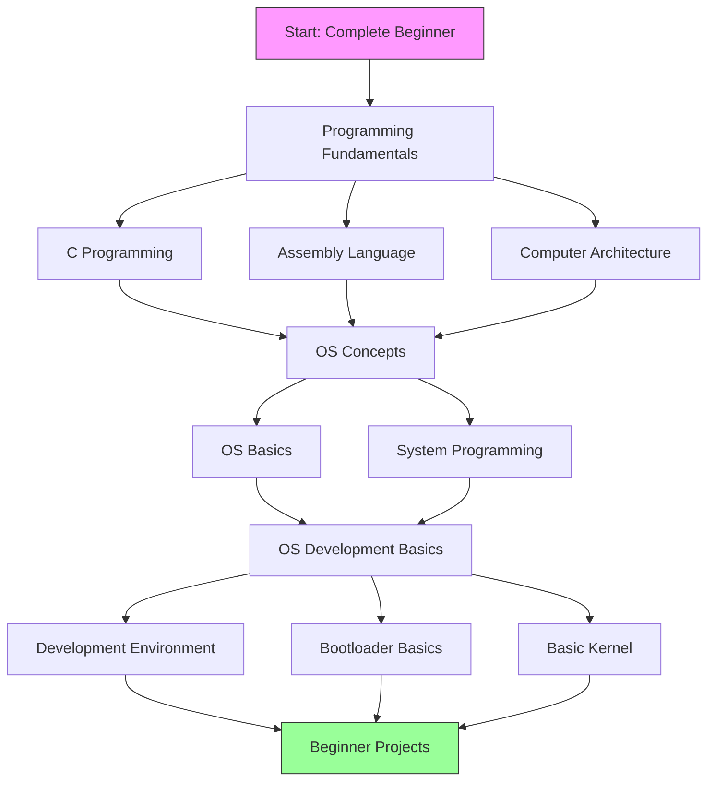

# Operating System Development Roadmap (Beginner Path)

## How to Follow?

## Phase 1: Programming Fundamentals
### 1.1 C Programming
- Basic syntax and control structures
- Pointers and memory management
- Data structures and algorithms
- Resource: [Learn C Programming](https://www.learn-c.org/)
- Practice: Build small C programs

### 1.2 Assembly Language
- Basic x86 assembly concepts
- CPU registers and instructions
- Memory addressing modes
- Resource: [NASM Tutorial](https://cs.lmu.edu/~ray/notes/nasmtutorial/)

### 1.3 Computer Architecture
- CPU architecture basics
- Memory hierarchy
- I/O systems
- Resource: [Computer Architecture Course](https://www.coursera.org/learn/comparch)

## Phase 2: OS Concepts
### 2.1 Operating System Basics
- OS structure and functions
- Process management
- Memory management
- Resource: [Operating Systems Course](https://www.coursera.org/learn/os-power-user)

### 2.2 System Programming
- File operations
- Process creation
- Inter-process communication
- Resource: [The Linux Programming Interface](https://man7.org/tlpi/)

## Phase 3: OS Development Basics
### 3.1 Development Environment
- Cross-compiler setup
- Emulator installation
- Basic debugging tools
- Resource: [OSDev Environment Setup](https://wiki.osdev.org/Setting_Up_Development_Environment)

### 3.2 Bootloader Basics
- BIOS basics
- Simple bootloader
- Protected mode
- Resource: [Writing a Bootloader](https://wiki.osdev.org/Bootloader)

### 3.3 Basic Kernel
- Kernel entry point
- Screen output
- Keyboard input
- Resource: [Bare Bones Kernel](https://wiki.osdev.org/Bare_Bones)

## Recommended Tools
- Virtual Box/VMware for Linux
- Visual Studio Code
- GCC compiler
- QEMU emulator

## Beginner Projects
1. Hello World bootloader
2. Simple shell implementation
3. Basic memory manager
4. Simple file system

## Learning Resources
- [Operating Systems: From 0 to 1](https://github.com/tuhdo/os01)
- [Little OS Book](https://littleosbook.github.io/)
- [Writing a Simple Operating System from Scratch](https://www.cs.bham.ac.uk/~exr/lectures/opsys/10_11/lectures/os-dev.pdf)
