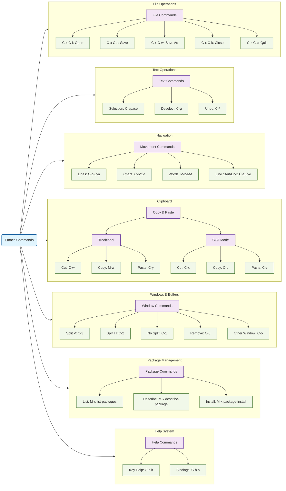

# GNU Emacs Cheatsheet

## Emacs Commands Relation Diagram


## Key Notation
- `C-` means hold the Control key
- `M-` means hold the Alt key (Meta) or press and release Escape
- `C-x` means press Control and 'x' together
- `M-x` means press Alt and 'x' together or press Escape then 'x'

## File Operations
| Command | Description |
|---------|-------------|
| `C-x C-f` | Open a file |
| `C-x C-s` | Save current file |
| `C-x C-w` | Save as... |
| `C-x C-k` | Close file |
| `C-x C-c` | Quit Emacs |

## Text Selection
| Command | Description |
|---------|-------------|
| `C-<space>` or `C-@` | Start selection |
| `C-g` | Deselect |

## Navigation Commands
### Line Navigation
| Command | Description |
|---------|-------------|
| `C-p` | Move to previous line |
| `C-n` | Move to next line |

### Character Navigation
| Command | Description |
|---------|-------------|
| `C-b` | Move back one character |
| `C-f` | Move forward one character |

### Word Navigation
| Command | Description |
|---------|-------------|
| `M-b` | Move back one word |
| `M-f` | Move forward one word |

### Line Boundaries
| Command | Description |
|---------|-------------|
| `C-a` | Go to start of line |
| `C-e` | Go to end of line |

## Copy & Paste Operations
### Traditional Emacs Style
| Command | Description |
|---------|-------------|
| `C-w` | Cut (Kill) |
| `M-w` | Copy |
| `C-y` | Paste (Yank) |
| `C-k` | Cut line after cursor |
| `M-d` | Cut word after cursor |

### Modern Style (CUA Mode)
| Command | Description |
|---------|-------------|
| `M-x cua-mode` | Activate modern copy & paste |
| `C-x` | Cut |
| `C-c` | Copy |
| `C-v` | Paste |

## Undo Operations
| Command | Description |
|---------|-------------|
| `C-/` or `C-x u` | Undo last operation |

## Windows, Frames, and Buffers
### Split Operations
| Command | Description |
|---------|-------------|
| `C-3` | Split window vertically |
| `C-2` | Split window horizontally |
| `C-1` | Remove all splits (single window) |
| `C-0` | Remove current window |

### Buffer Management
| Command | Description |
|---------|-------------|
| `C-x <arrow>` | Cycle through active buffers |
| `C-o` | Visit other split window |

### Frame Management
| Command | Description |
|---------|-------------|
| `C-x 52` | Open a new frame |

## Emergency Commands
| Command | Description |
|---------|-------------|
| `C-g` | Cancel current operation/command |

## Help System
| Command | Description |
|---------|-------------|
| `C-h k <key combo>` | Show key combination binding |
| `C-h b` | Display all key bindings |

## Package Management
| Command | Description |
|---------|-------------|
| `M-x list-packages` | List all available packages |
| `M-x describe-package` | Describe package at cursor |
| `M-x package-menu-mark-install` | Mark package for installation |
| `M-x package-install-selected-packages` | Install marked packages |

## Important Concepts
1. **Buffer**: Holds a process or file content
2. **Window**: Your view of a buffer
3. **Frame**: The desktop window containing Emacs

## Additional Navigation Methods
- Use arrow keys for cursor movement if available
- Use mouse to click and drag for text selection

## Tips for New Users
1. Start with basic file operations and navigation
2. Learn the help system commands early
3. Consider using CUA mode if coming from other editors
4. Practice emergency cancel (`C-g`) for when things go wrong
5. Use package management to extend functionality

## Customization Basics
```elisp
;; Add to your .emacs file or init.el
;; Enable CUA mode for familiar copy-paste
(cua-mode t)

;; Enable line numbers
(global-display-line-numbers-mode)

;; Enable syntax highlighting
(global-font-lock-mode t)
```

## Common Workflows

### File Management Workflow
1. Open Emacs
2. Use `C-x C-f` to find file
3. Edit content
4. Save with `C-x C-s`
5. Close with `C-x C-k` or quit Emacs with `C-x C-c`

### Text Editing Workflow
1. Navigate to location
2. Start selection with `C-<space>`
3. Move cursor to select text
4. Cut/copy as needed
5. Navigate to new location
6. Paste content

### Window Management Workflow
1. Split window as needed (`C-2` or `C-3`)
2. Open different files in splits
3. Use `C-o` to switch between splits
4. Close splits when done (`C-0` or `C-1`)

## Best Practices
1. Learn the help system first
2. Practice navigation commands
3. Use package management for extensions
4. Learn buffer management
5. Master window splitting
6. Understand the difference between kill/yank and modern copy/paste
7. Keep emergency commands in mind
