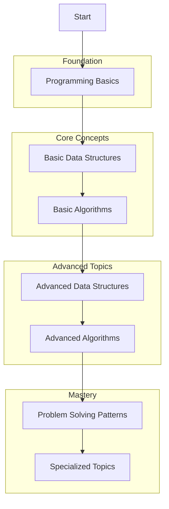

# Table of Content
1. [Language-Agnostic DSA Roadmap](#language-agnostic-dsa-roadmap)
2. [Language-Agnostic DSA Resources](#language-agnostic-dsa-resources)

# Language-Agnostic DSA Roadmap

## Learning Path Visualization

## Detailed Breakdown

### Foundation (2-3 weeks)
- Time & Space Complexity
- Big O Notation
- Memory concepts
- Basic programming constructs
- Problem-solving methodology

### Core Concepts (8-10 weeks)
1. Basic Data Structures
   - Arrays
   - Linked Lists
   - Stacks
   - Queues
   - Hash Tables
   - Basic Trees

2. Basic Algorithms
   - Searching
   - Sorting
   - Recursion
   - Two Pointers
   - Sliding Window

### Advanced Topics (10-12 weeks)
1. Advanced Data Structures
   - Advanced Trees
   - Graphs
   - Heaps
   - Tries
   - Segment Trees
   - Bloom Filters

2. Advanced Algorithms
   - Dynamic Programming
   - Greedy Algorithms
   - Backtracking
   - Graph Algorithms
   - String Algorithms

### Mastery (Ongoing)
1. Problem Solving Patterns
   - Pattern recognition
   - Optimization techniques
   - System design basics
   - Interview preparation

2. Specialized Topics
   - Computational Geometry
   - Network Flow
   - Advanced String Algorithms
   - Parallel Algorithms

# Language-Agnostic DSA Resources

## Online Courses
1. [Algorithms Part I - Princeton](https://www.coursera.org/learn/algorithms-part1)
   - Fundamental algorithms
   - Theoretical foundation
   - Programming assignments

2. [Algorithm Specialization - Stanford](https://www.coursera.org/specializations/algorithms)
   - Comprehensive coverage
   - Advanced topics
   - Real-world applications

## Books
1. "Introduction to Algorithms" (CLRS)
   - Comprehensive coverage
   - Theoretical foundation
   - Problem sets

2. "Algorithm Design Manual" by Skiena
   - Practical approach
   - Real-world examples
   - Problem-solving strategies

3. "Grokking Algorithms" by Bhargava
   - Visual explanations
   - Simple examples
   - Beginner-friendly

## Online Platforms
1. [LeetCode](https://leetcode.com/)
   - Structured problems
   - Company-specific lists
   - Discussion forums

2. [AlgoExpert](https://www.algoexpert.io/)
   - Curated problems
   - Video explanations
   - Interview preparation

3. [InterviewBit](https://www.interviewbit.com/)
   - Programming interview focus
   - Company-wise problems
   - Mock interviews

## Websites
1. [Visualgo](https://visualgo.net/)
   - Algorithm visualization
   - Interactive learning
   - Step-by-step execution

2. [USACO Guide](https://usaco.guide/)
   - Competitive programming
   - Comprehensive tutorials
   - Practice problems

## YouTube Channels
1. [Back To Back SWE](https://www.youtube.com/channel/UCmJz2DV1a3yfgrR7GqRtUUA)
   - Detailed explanations
   - Visual presentations
   - Interview preparation

2. [Abdul Bari](https://www.youtube.com/channel/UCZCFT11CWBi3MHNlGf019nw)
   - Algorithm explanations
   - Mathematical approach
   - Theoretical foundation

## Practice Platforms
1. [AtCoder](https://atcoder.jp/)
   - Regular contests
   - Various difficulty levels
   - Active community

2. [SPOJ](https://www.spoj.com/)
   - Classical problems
   - Judge system
   - Multiple languages

## GitHub Resources
1. [Coding Interview University](https://github.com/jwasham/coding-interview-university)
   - Complete study plan
   - Resource compilation
   - Interview preparation

2. [JavaScript Algorithms](https://github.com/trekhleb/javascript-algorithms)
   - DSA implementations
   - Explanations
   - Examples
