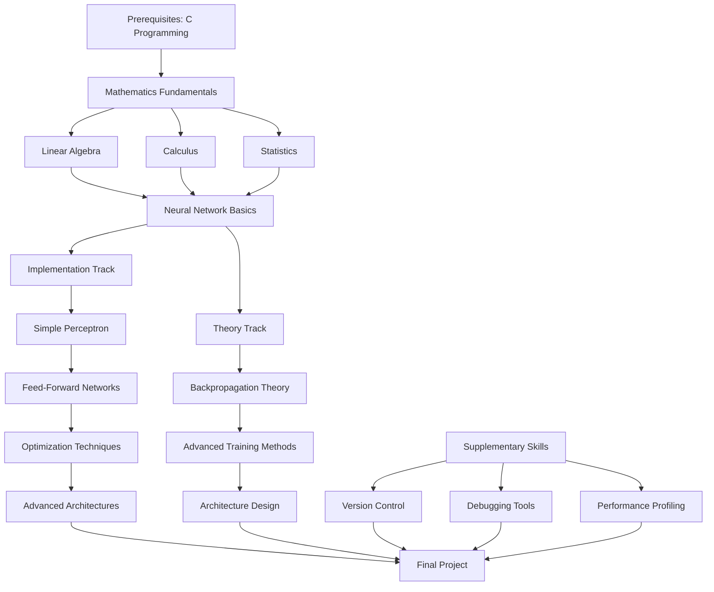

```mermaid
graph TD
    A[Prerequisites: C Programming] --> B[Mathematics Fundamentals]
    B --> B1[Linear Algebra]
    B --> B2[Calculus]
    B --> B3[Statistics]
    
    B1 & B2 & B3 --> C[Neural Network Basics]
    
    C --> D[Implementation Track]
    C --> E[Theory Track]
    
    D --> D1[Simple Perceptron]
    D1 --> D2[Feed-Forward Networks]
    D2 --> D3[Optimization Techniques]
    D3 --> D4[Advanced Architectures]
    
    E --> E1[Backpropagation Theory]
    E1 --> E2[Advanced Training Methods]
    E2 --> E3[Architecture Design]
    
    D4 & E3 --> F[Final Project]
    
    G[Supplementary Skills] --> G1[Version Control]
    G --> G2[Debugging Tools]
    G --> G3[Performance Profiling]
    
    G1 & G2 & G3 --> F
```
