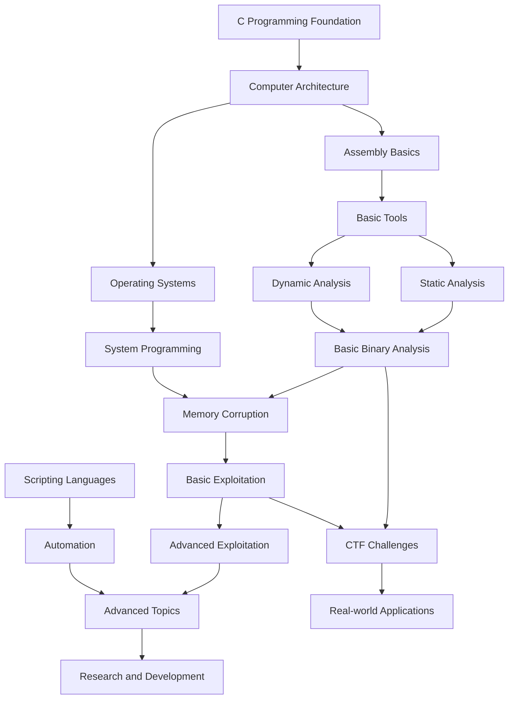

```mermaid
graph TD
    A[C Programming Foundation] --> B[Computer Architecture]
    B --> C[Assembly Basics]
    C --> D[Basic Tools]
    D --> E[Static Analysis]
    D --> F[Dynamic Analysis]
    
    E --> G[Basic Binary Analysis]
    F --> G
    G --> H[Memory Corruption]
    
    H --> I[Basic Exploitation]
    I --> J[Advanced Exploitation]
    
    J --> K[Advanced Topics]
    K --> L[Research and Development]
    
    %% Optional but recommended paths
    B --> M[Operating Systems]
    M --> N[System Programming]
    N --> H
    
    %% Skill enhancement paths
    O[Scripting Languages] --> P[Automation]
    P --> K
    
    %% Practice paths
    Q[CTF Challenges] --> R[Real-world Applications]
    G --> Q
    I --> Q
```